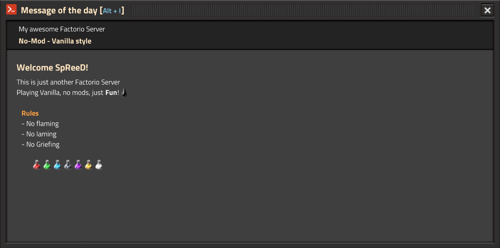
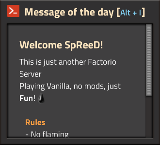
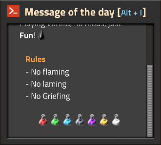
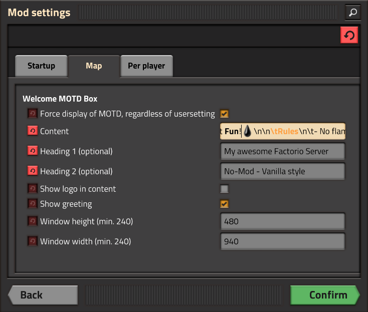

#### Factorio-Mod
# Welcome MOTD Box
---

### Features

 - Supports Factorio Rich-Text
   - Enables you to use item icons, colors and fonts
   - See [https://wiki.factorio.com/Rich_text](https://wiki.factorio.com/Rich_text) for more information
    - Check `\Factorio\data\base\locale\en\base.cfg` for item names under section `[item-name]`
 - Player and Admin settings
   - Enforce MOTD display
   - Toggle parts on/off
 - GUI Icon
 - Customizable size (width & height)
 - Shortcut `ALT + I` to display the window
 
### Screenshots

### Trivia

String used in the example:  `This is just another Factorio Server\nPlaying Vanilla, no mods, just [font=default-bold]Fun[/font]![fluid=crude-oil]\n\n[color=orange][font=default-bold]\tRules[/font][/color]\n\t- No flaming\n\t- No laming\n\t- No Griefing\n\n\t\t\t[item=automation-science-pack][item=logistic-science-pack][item=chemical-science-pack][item=military-science-pack][item=production-science-pack][item=utility-science-pack][item=space-science-pack]`

### Enjoying this?
Just star the repo or make a donation.

{:target="_blank"}

Your help is valuable since this is a hobby project for all of us: we do development during out-of-office hours.

### Contribution
Pull requests are very welcome.
### Copyrights
Initially created by **Markus Karl Wackermann**.
